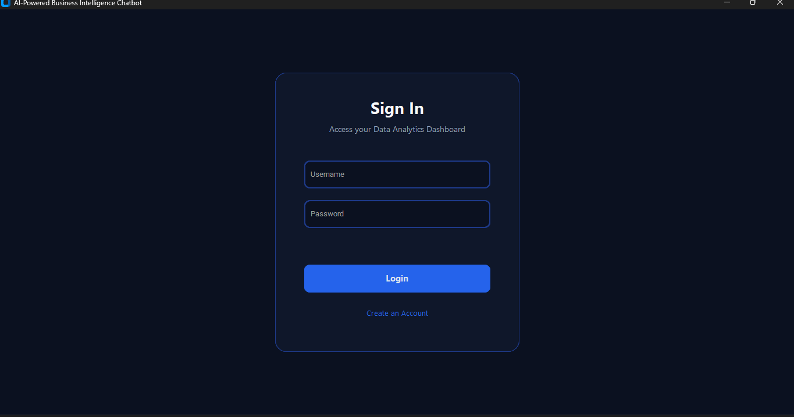
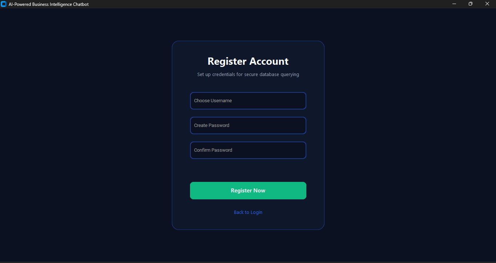
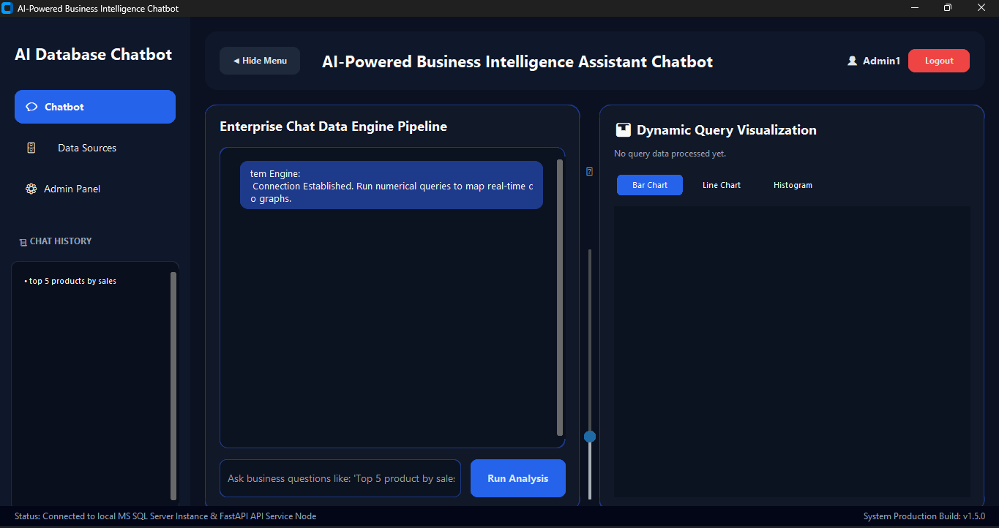
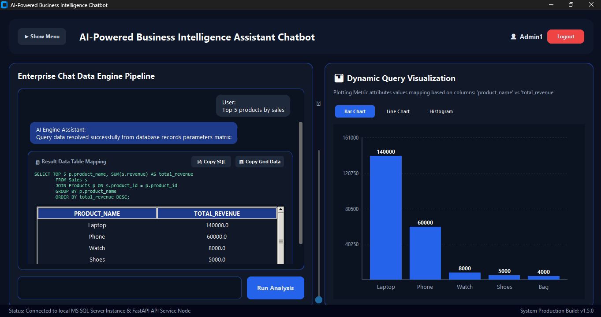

# 🤖 AI-Powered Business Intelligence Chatbot

An intelligent Text-to-SQL Business Intelligence system that enables users to interact with business databases using natural language. The chatbot automatically converts user queries into SQL statements, retrieves data from SQL Server, and presents insights through interactive tables and visualizations.


---

# 📌 Project Overview

Organizations generate large volumes of data, but business users often lack SQL knowledge to extract insights effectively.

This project solves that problem by allowing users to ask business questions in plain English such as:

- Top 5 products by sales
- Top 10 products by profit
- Sales by region
- Monthly sales trend

The system automatically:

✅ Understands the user's request

✅ Converts it into SQL queries

✅ Executes queries on SQL Server

✅ Retrieves data using Pandas

✅ Displays results in tabular format

✅ Generates dynamic visualizations

---

# 🎯 Key Features

## 🔐 User Authentication System

- User Login
- User Registration
- Secure User Management
- Session Handling

## 💬 Natural Language Query Interface

Users can ask:

```text
Top 5 products by sales

Top 10 products by profit

Sales by region

Monthly sales trend
```

without writing SQL.

---

## 🧠 Text-to-SQL Engine

Automatically converts natural language into SQL queries.

Example:

Input:

```text
Top 5 products by sales
```

Generated SQL:

```sql
SELECT TOP 5 p.product_name,
SUM(s.revenue) AS total_revenue
FROM Sales s
JOIN Products p
ON s.product_id = p.product_id
GROUP BY p.product_name
ORDER BY total_revenue DESC;
```

---

## 📊 Interactive Business Intelligence Dashboard

Supports:

- Dynamic Tables
- Bar Charts
- Line Charts
- Histograms

---

## 📜 Query History Tracking

- Stores previous user queries
- Quick query replay
- Persistent history storage

---

## ⚡ FastAPI Backend

REST API layer for:

- Query Processing
- SQL Generation
- Database Execution
- Response Handling

---

# 🏗️ System Architecture

```text
+---------------------+
|      User           |
+----------+----------+
           |
           v
+---------------------+
| CustomTkinter GUI   |
+----------+----------+
           |
           v
+---------------------+
|    FastAPI Server   |
+----------+----------+
           |
           v
+---------------------+
|   Text-to-SQL Engine|
+----------+----------+
           |
           v
+---------------------+
|    SQL Server DB    |
+----------+----------+
           |
           v
+---------------------+
|      Pandas         |
+----------+----------+
           |
           v
+---------------------+
| Tables & Charts     |
+---------------------+
```

---

# 🛠️ Technology Stack

| Category | Technology |
|-----------|------------|
| Programming Language | Python |
| Backend Framework | FastAPI |
| Database | SQL Server |
| Database Connector | PyODBC |
| Data Processing | Pandas |
| GUI Framework | CustomTkinter |
| Authentication | JSON-Based |
| Visualization | Custom Chart Engine |
| API Server | Uvicorn |

---

# 📂 Project Structure

```text
AI-Powered-Business-Intelligence-Chatbot/
│
├── app.py
├── fastapi_server.py
├── text_to_sql.py
├── query_executor.py
├── db_connection.py
├── config.py
├── utils.py
│
├── users_auth.json
├── chat_history.json
│
├── requirements.txt
│
├── screenshots/
│   ├── login_page.png
│   ├── registration_page.png
│   ├── dashboard.png
│   ├── query_results.png
│   ├── charts.png
│   └── admin_panel.png
│
└── README.md
```

---

# 📷 Screenshots

## 🔐 Login Page



---

## 📝 Registration Page



---

## 📊 Query Results



---

## 📈 Data Visualization



---

# 🚀 Installation Guide

## Step 1: Clone Repository

```bash
git clone https://github.com/YOUR_USERNAME/AI-Powered-Business-Intelligence-Chatbot.git

cd AI-Powered-Business-Intelligence-Chatbot
```

---

## Step 2: Create Virtual Environment

### Windows

```bash
python -m venv venv

venv\Scripts\activate
```

### Linux / Mac

```bash
python3 -m venv venv

source venv/bin/activate
```

---

## Step 3: Install Required Packages

```bash
pip install -r requirements.txt
```

---

# 🗄️ Database Setup

## Install SQL Server

Install:

- Microsoft SQL Server
- SQL Server Management Studio (SSMS)

Official Download:

https://www.microsoft.com/en-us/sql-server

---

## Create Database

```sql
CREATE DATABASE chatbot_db;
```

---

## Create Products Table

```sql
CREATE TABLE Products(
    product_id INT PRIMARY KEY,
    product_name VARCHAR(100)
);
```

---

## Create Customers Table

```sql
CREATE TABLE Customers(
    customer_id INT PRIMARY KEY,
    customer_name VARCHAR(100),
    region VARCHAR(100)
);
```

---

## Create Sales Table

```sql
CREATE TABLE Sales(
    sale_id INT PRIMARY KEY,
    product_id INT,
    customer_id INT,
    revenue FLOAT,
    profit FLOAT,
    sale_date DATE
);
```

---

## Insert Sample Data

Populate:

- Products
- Customers
- Sales

tables with sample records.

---

# ⚙️ Database Configuration

Open:

```text
config.py
```

Update:

```python
DB_CONFIG = {
    "server": "YOUR_SERVER_NAME",
    "database": "chatbot_db",
    "username": "YOUR_USERNAME",
    "password": "YOUR_PASSWORD",
    "driver": "ODBC Driver 17 for SQL Server"
}
```

---

# ▶️ Running the Project

## Start FastAPI Server

Open Terminal 1:

```bash
python fastapi_server.py
```

Expected Output:

```text
Uvicorn running on:

http://127.0.0.1:8000
```

Verify API:

```text
http://127.0.0.1:8000
```

---

## Start Desktop Application

Open Terminal 2:

```bash
python app.py
```

The GUI application will launch.

---

# 🔑 Demo Credentials

```text
Username: admin
Password: admin123
```

---

# 📋 Example Queries

```text
Top 5 products by sales

Top 10 products by profit

Sales by region

Monthly sales trend

Revenue by region

Best products by revenue

Top products by earnings

Highest revenue products
```

---

# 🔌 API Usage

## Endpoint

```http
POST /query
```

Request:

```json
{
  "user_query": "Top 5 products by sales"
}
```

Response:

```json
{
  "generated_sql": "SELECT TOP 5 ...",
  "is_df": true,
  "columns": [
    "product_name",
    "total_revenue"
  ],
  "data": [
    ["Laptop", 50000],
    ["Phone", 40000]
  ]
}
```

---

# 🎓 Academic Relevance

This project demonstrates practical implementation of:

- Database Management Systems
- Natural Language Processing Concepts
- Business Intelligence Systems
- Data Analytics
- Data Visualization
- REST API Development
- Software Engineering
- Human Computer Interaction

Suitable for:

- B.Tech Final Year Project
- Computer Science Engineering
- Information Technology
- Data Analytics Projects

---

# 🔮 Future Enhancements

- OpenAI GPT Integration
- Gemini API Integration
- LangChain Integration
- LLM-Based Text-to-SQL
- Role-Based Access Control
- PDF Report Export
- Dashboard Analytics
- Voice Assistant Support
- Cloud Deployment
- Multi-Database Support
- Real-Time Data Monitoring

---

# 👨‍💻 Author

**Faraz Niyazi**

B.Tech Computer Science Engineering

Aspiring Data Analyst | AI Engineer | Machine Learning Enthusiast

### Skills

- Python
- SQL
- Power BI
- FastAPI
- Machine Learning
- Data Analytics
- Business Intelligence

---

# ⭐ Support

If you found this project useful:

⭐ Star the repository

🍴 Fork the project

📢 Share feedback and suggestions

---

# 📜 License

This project is developed for educational, academic, and portfolio purposes.

Copyright © 2026 Faraz Niyazi
